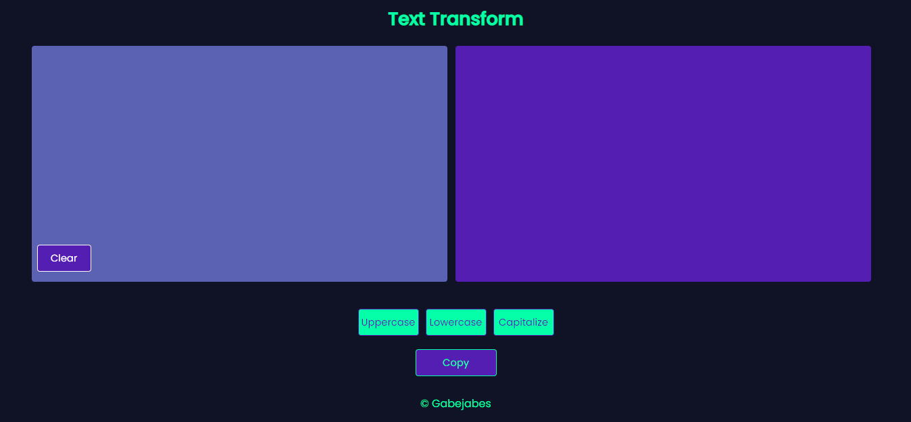
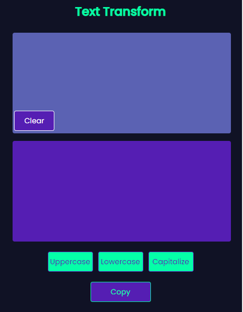
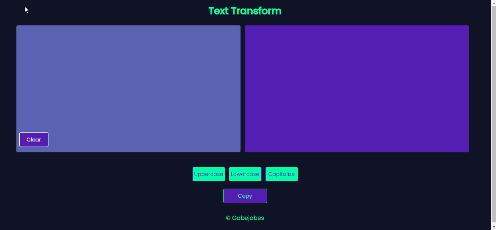



    
     
     

## 📖Sobre
Criado para facilitar a manipulação de grandes textos que estão em uma tipagem diferente da desejada (letras minúsculas, maiúsculas, capitalizadas).

## Home

## Mobile

    

## ⚙Funcionamento

## Demo
site online: [demo](https://araujogabriel77.github.io/text-transform.github.io/)

------
## 💻Tecnologias

- HTML
- CSS
- Javascript
- React Native
- Expo
- Express
- axios

## 🚀Instalando-o-projeto

Basta baixar o projeto e rodar o arquivo index.html

----
## 🐱‍👤Autor
[Gabriel Araujo](https://github.com/araujogabriel77)

💼 **Linkedin**: [_Gabriel Ferreira_ ](https://www.linkedin.com/in/araujogabriel77/)

📩 **email**: araujogabrielocn@gmail.com

----
## 📃License

This project is licensed under the MIT License - see the  [LICENSE.md](./LICENSE.md)  file for details